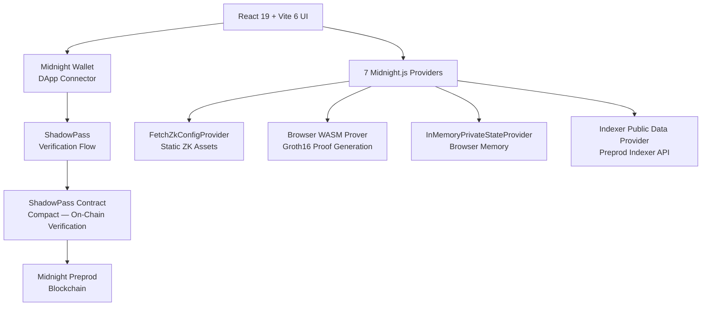

# ShadowPass

**Private Allowlist Access on Midnight — prove membership without revealing identity.**

[](https://github.com/Sujal4242/ShadowPass/actions/workflows/ci.yml)
[](LICENSE)

ShadowPass is a complete Midnight dApp that solves the **Private Allowlist Access** problem. Users prove they are members of an authorized allowlist using a zero-knowledge proof — without revealing their identity, membership credential, or salt. The Groth16 ZK proof is generated entirely in the browser and verified on-chain by a Compact smart contract deployed to Midnight Preprod.

---

## Table of Contents

- [Project Overview](#project-overview)
- [Level 3 Alignment](#level-3-alignment)
- [Key Features](#key-features)
- [How It Works](#how-it-works)
- [Privacy Model](#privacy-model)
- [Architecture](#architecture)
- [Project Structure](#project-structure)
- [Smart Contract](#smart-contract)
- [Wallet & Midnight Integration](#wallet--midnight-integration)
- [Running Locally](#running-locally)
- [Testing](#testing)
- [CI/CD](#cicd)
- [Preprod Deployment](#preprod-deployment)
- [Demo](#demo)
- [Security & Secrets](#security--secrets)
- [Project Status](#project-status)
- [Level 3 Submission Checklist](#level-3-submission-checklist)
- [License](#license)

---

## Project Overview

Access control systems routinely require users to prove authorization — but traditional approaches reveal *who* is requesting access, creating surveillance risk. ShadowPass solves this by decoupling identity from authorization.

ShadowPass implements the **Private Allowlist Access** problem from the Midnight Level 3 requirements. A user proves membership in an authorized allowlist using a zero-knowledge proof:

- The user possesses a private credential: `(memberId, salt)`.
- A Compact smart contract stores 8 Pedersen commitments on-chain, one per allowlist slot.
- The ZK circuit computes `persistentCommit(memberId, salt)` and asserts it matches one of the 8 on-chain commitments.
- The Groth16 proof is generated in-browser and verified on-chain.
- The raw credential never leaves the user's browser.

The result: the blockchain verifies "this user is authorized" without learning *which* member they are.

---

## Level 3 Alignment

| Requirement | ShadowPass Implementation | Status |
|---|---|---|
| Meaningful Midnight privacy functionality | ZK proof of membership without credential disclosure | Done |
| Private Allowlist Access idea | 8-slot allowlist with Pedersen commitments | Done |
| Smart contract | `contracts/shadowpass.compact` (Compact language) | Done |
| Zero-knowledge proof | Groth16 proof via `persistentCommit` circuit | Done |
| Wallet integration | Midnight DApp Connector (1AM / Lace) | Done |
| Tests | 28/28 passing (contract, circuit, wallet state) | Done |
| CI/CD | GitHub Actions: compile → TypeScript → build → test | Done |
| Public GitHub repository | [Sujal4242/ShadowPass](https://github.com/Sujal4242/ShadowPass) | Done |
| 10 meaningful commits | 10 commits covering all development phases | Done |
| Privacy model documentation | Documented in this README and `docs/evidence/` | Done |

---

## Key Features

- **Private membership verification** — prove you're on the allowlist without revealing which entry you hold
- **Zero-knowledge proof flow** — Groth16 proof generated entirely in the browser
- **Midnight wallet connection** — DApp Connector API with 1AM and Lace wallets
- **Preprod network integration** — deployed and verified on Midnight Preprod
- **Access verification result** — real-time proof status with granted/denied feedback
- **Privacy explanation** — in-app section explaining what is and isn't revealed
- **On-chain access count** — public ledger of successful verifications (count only)
- **Responsive UI** — polished interface with animated design system
- **Automated tests** — 28 tests covering contract logic, ZK proofs, and wallet state
- **GitHub Actions CI** — compile, typecheck, build, and test on every push

---

## How It Works

```
User
  │
  ▼
Connect Midnight Wallet (DApp Connector)
  │
  ▼
Enter membership credential (memberId + salt)
  │
  ▼
Browser computes persistentCommit(memberId, salt)
  │
  ▼
Groth16 ZK proof generated in browser (via wallet WASM prover)
  │
  ▼
Proof submitted to Midnight Preprod
  │
  ▼
Smart contract verifies proof against 8 on-chain commitments
  │
  ▼
Access Granted / Denied
```

**What becomes public:** The ZK proof itself, the access count increment, and the contract address.

**What stays private:** The raw `memberId`, the `salt`, and which specific allowlist entry matched.

---

## Privacy Model

### What an observer CAN learn

- A proof of membership was submitted to the contract
- The `accessCount` incremented (total number of successful verifications)
- The contract address and allowlist commitments (8 Pedersen hashes)
- The ZK proof data (Groth16 proof bytes)

### What an observer CANNOT learn

- The raw `memberId` or `salt` used to generate the proof
- Which of the 8 allowlist slots matched the credential
- The identity or wallet address of the prover (membership is verified via commitment, not wallet address)
- Any linking between multiple proofs from the same member

### Disclaimer

The privacy guarantee applies to the membership proof and credential data. It does not imply that all blockchain metadata or wallet activity is anonymous. Network-level metadata, wallet connection events, and transaction timing may be observable by the wallet provider or network infrastructure.

---

## Architecture



The app uses 7 midnight-js providers assembled in `frontend/src/midnight/providers.ts`:

| Provider | Source |
|----------|--------|
| ZK Config | `FetchZkConfigProvider` — reads ZKIR/keys from static assets |
| Proof | `connectedAPI.getProvingProvider()` — browser WASM prover |
| Private State | `InMemoryPrivateStateProvider` — empty (no witnesses) |
| Public Data | `indexerPublicDataProvider()` — Midnight Preprod indexer |
| Wallet | `connectedAPI` — DApp Connector |
| Midnight | `connectedAPI` — DApp Connector |

---

## Project Structure

```
ShadowPass/
├── .github/workflows/ci.yml    # CI: compile → TypeScript → build → test
├── contracts/
│   └── shadowpass.compact       # Compact privacy contract (26 lines)
├── docs/
│   ├── evidence/                # Deployment evidence, architecture, credentials
│   └── history/                 # Development phase documentation
├── frontend/
│   ├── public/midnight/         # ZK assets (zkir, keys) — copied at build time
│   ├── scripts/                 # Build scripts (copy-zk-assets)
│   ├── src/
│   │   ├── App.tsx              # Main application component
│   │   ├── components/          # UI components (12 files)
│   │   ├── hooks/               # React hooks (useMidnight, useShadowPass, usePhase1)
│   │   ├── midnight/            # Midnight provider layer (5 files)
│   │   └── shims/               # Browser polyfills (cross-fetch, isomorphic-ws)
│   ├── index.html               # HTML entry point
│   ├── vite.config.ts           # Vite configuration
│   └── package.json             # Frontend dependencies
├── scripts/
│   ├── deploy-v2.ts             # Contract deployment script
│   └── wallet-state.ts          # Wallet state inspection utility
├── tests/
│   ├── shadowpass.test.ts       # Contract/circuit tests (13 tests)
│   └── wallet-state.test.ts     # Wallet state tests (15 tests)
├── compose.yml                  # Local proof server configuration
├── package.json                 # Root dependencies and scripts
├── tsconfig.json                # Root TypeScript config
├── vitest.config.ts             # Test configuration
├── PROPOSAL.md                  # Level 3 submission proposal
└── README.md                    # This file
```

---

## Smart Contract

The ShadowPass contract is written in Compact and lives at `contracts/shadowpass.compact`:

```compact
pragma language_version >= 0.23;

import CompactStandardLibrary;

export ledger allowlist: Vector<8, Bytes<32>>;
export ledger accessCount: Field;

constructor(members: Vector<8, Bytes<32>>) {
  allowlist = disclose(members);
}

export circuit proveMembership(memberId: Bytes<32>, salt: Bytes<32>): [] {
  const claim = persistentCommit<Bytes<32>>(memberId, salt);
  assert(
    (claim == allowlist[0]) || (claim == allowlist[1]) ||
    (claim == allowlist[2]) || (claim == allowlist[3]) ||
    (claim == allowlist[4]) || (claim == allowlist[5]) ||
    (claim == allowlist[6]) || (claim == allowlist[7]),
    "Not an authorized member"
  );
  accessCount = accessCount + 1;
}
```

- **`constructor`** — initializes 8 Pedersen commitments from the allowlist vector
- **`proveMembership`** — computes `persistentCommit(memberId, salt)` and asserts it matches one of the 8 slots
- **No witnesses** — the circuit takes explicit `Bytes<32>` arguments, no private state
- **`accessCount`** — incremented on each successful verification

---

## Wallet & Midnight Integration

ShadowPass connects to the user's Midnight-compatible wallet via the **DApp Connector API** (`window.midnight`):

1. **Discovery** — the app enumerates installed Midnight wallets (1AM, Lace)
2. **Connection** — `wallet.connect(networkId)` returns a `ConnectedAPI` instance
3. **Provider assembly** — 7 providers are assembled from the connected wallet
4. **Contract interaction** — `findDeployedContract()` loads the deployed contract at `4cae45d1...`
5. **Proof generation** — `connectedAPI.getProvingProvider()` delegates Groth16 proving to the wallet's WASM prover
6. **Transaction submission** — the wallet balances and submits the transaction to Midnight Preprod

**Network:** Midnight Preprod (testnet — no real value at stake)

---

## Running Locally

**Requirements:** Node.js >= 22.0.0, Midnight wallet extension (1AM or Lace)

### Installation

```bash
# Install root dependencies
npm install

# Install frontend dependencies
npm --prefix frontend install
```

### Compilation

```bash
# Compile the Compact contract
npm run compile
```

### Tests

```bash
# Run all 28 tests
npm test
```

### TypeScript Check

```bash
# Typecheck root project
npm run build

# Typecheck frontend
cd frontend && npx tsc -b --noEmit
```

### Frontend Development

```bash
# Start Vite dev server
npm run dev:frontend
# → http://localhost:5173
```

### Production Build

```bash
# Build frontend for production
npm run build:frontend
```

---

## Testing

The project includes **28 automated tests** across two test suites:

| Suite | Tests | Description |
|-------|-------|-------------|
| `shadowpass.test.ts` | 13 | Contract creation, Groth16 proof generation, ZK circuit verification, invalid credential rejection, no data exposure, commitment determinism |
| `wallet-state.test.ts` | 15 | Wallet state serialization, version handling, atomic writes, corruption recovery, network isolation |

### What the tests validate

- CompactContract creation and witness generation
- Groth16 proof generation and on-chain verification
- ZK circuit constraint satisfaction
- Invalid credential rejection (unauthorized member)
- No raw `memberId` or `salt` exposed in on-chain transcript
- Commitment determinism (`persistentCommit` is deterministic)
- Wallet state persistence round-trips and error handling

### Latest validation

```
Compact compile     ✅ Clean
TypeScript          ✅ Clean
Frontend build      ✅ Clean (Vite production build)
Tests               ✅ 28/28 passing
```

---

## CI/CD

The project uses **GitHub Actions** for continuous integration:

**Workflow:** `.github/workflows/ci.yml`

| Stage | Command |
|-------|---------|
| Checkout | `actions/checkout@v4` |
| Node.js 22 | `actions/setup-node@v4` |
| Compact CLI | Install from Midnight releases |
| Compiler 0.31.1 | `compact update 0.31.1` |
| Root deps | `npm ci` |
| Frontend deps | `npm ci` (in `frontend/`) |
| Contract compile | `npm run compile` |
| TypeScript check | `npm run build` |
| Frontend build | `npm run build:frontend` |
| Unit tests | `npm test` (15 min timeout) |

Triggered on push to `main` and pull requests to `main`.

---

## Preprod Deployment

| Field | Value |
|-------|-------|
| **Network** | Midnight Preprod |
| **Contract address** | `4cae45d1c4e6d2acc4e607f60cd61c19b77c31c84af0cc72c827889271041f44` |
| **Explorer** | [View on Explorer](https://explorer.preprod.midnight.network/contract/4cae45d1c4e6d2acc4e607f60cd61c19b77c31c84af0cc72c827889271041f44) |
| **Allowlist size** | 8 slots (`Vector<8, Bytes<32>>`) |
| **Compiler** | Compact 0.31.1 |
| **Runtime** | compact-runtime 0.16.0 |

> **Note:** Midnight Preprod is a test network. Test tokens are obtained from the network faucet. No real value is at stake.

Full deployment evidence: [`docs/evidence/DOCUMENT.md`](docs/evidence/DOCUMENT.md)

---

## Demo

### Demo Flow

1. Open the ShadowPass dApp in a browser with a Midnight wallet extension
2. Click **Connect Wallet** and approve the DApp Connector prompt
3. Enter the demo membership credential (see below)
4. Click **Verify Membership** to generate a ZK proof
5. Approve the wallet transaction if prompted
6. View the verification result: **Access Granted**
7. The on-chain `accessCount` increments

### Demo Credentials

| Field | Value |
|-------|-------|
| **Member ID** | `deadbeef000000000000000000000000000000000000000000000000deadbeef` |
| **Salt** | `cafebabe000000000000000000000000000000000000000000000000cafebabe` |

These credentials are **public by design** for demonstration purposes. See [`docs/evidence/DEMO-CREDENTIALS.md`](docs/evidence/DEMO-CREDENTIALS.md) for details.

> **Production credential model:** In a production system, credentials are generated and distributed privately by an authorized issuer. The demonstration uses public credentials to show the ZK proof flow without requiring a backend enrollment system.

---

## Security & Secrets

The repository is configured to **never commit** sensitive material:

- `.env` files are gitignored (only `.env.example` is tracked)
- Wallet seed phrases and private keys are never stored in the repository
- Generated artifacts (`contracts/managed/`, `frontend/dist/`, `*.tsbuildinfo`) are gitignored
- Wallet state directories (`.midnight-wallet-state/`, `midnight-level-db/`) are gitignored
- Demo credentials documented in this README and `docs/evidence/` are public by design

The deployment script (`scripts/deploy-v2.ts`) requires `SHADOWPASS_DEPLOYER_SEED` as an environment variable — this is never stored in the repository.

---

## Project Status

| Component | Status |
|---|---|
| Compact contract | Deployed on Preprod |
| Privacy circuit | Groth16 proof — verified end-to-end |
| Wallet integration | DApp Connector (1AM, Lace) |
| Frontend | React 19 + Vite 6 — production build clean |
| Tests | 28/28 passing |
| TypeScript | Clean |
| CI/CD | GitHub Actions — compile, typecheck, build, test |
| Preprod deployment | Live at `4cae45d1...` |
| Documentation | Complete (evidence, architecture, history) |

---

## Level 3 Submission Checklist

- [x] Private Allowlist Access selected
- [x] Functional Midnight privacy functionality
- [x] Minimum 3 tests passing (28/28)
- [x] CI/CD workflow
- [x] Public GitHub repository
- [x] README privacy model
- [x] Minimum 10 meaningful commits
- [ ] Live demo link
- [ ] Test-output screenshot
- [ ] 1-minute demo video
- [ ] Product proposal approval

---

## License

[MIT](LICENSE)
